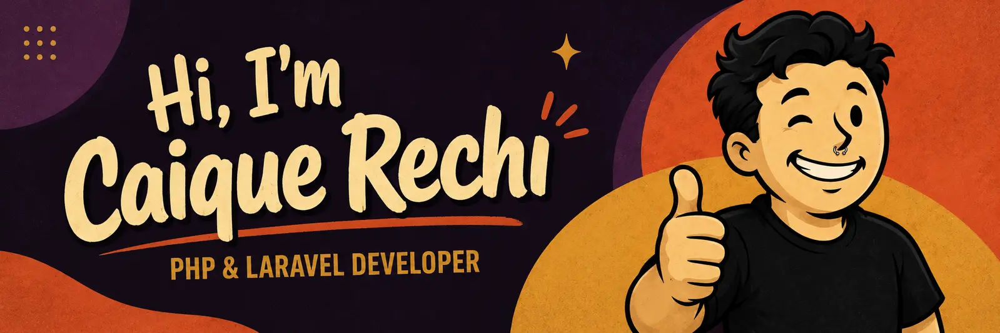
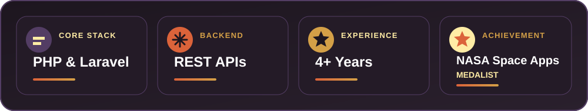

  

# Hi, I'm Caique Rechi 👋

**Backend-Focused Full-Stack Developer | PHP & Laravel**

I’m a Brazilian developer with 5+ years of experience building web applications, REST APIs, payment integrations and internal business systems.

I enjoy transforming complex business rules into secure and maintainable software.

### Main stack

  

  <strong>PHP</strong> · <strong>Laravel</strong> · MySQL · JavaScript · HTML · CSS · Tailwind CSS · Docker · Git · GitHub

### GitHub highlights

  

### A little more about me

* Experienced with REST APIs, webhooks and payment integrations
* Comfortable maintaining and modernizing legacy PHP applications
* NASA Space Apps Challenge medalist
* Based in Brazil and open to remote opportunities

[Portfolio](https://rechi.net.br/) · [LinkedIn](https://www.linkedin.com/in/caique-rechi/)

> Building useful software and leaving the codebase better than I found it.
