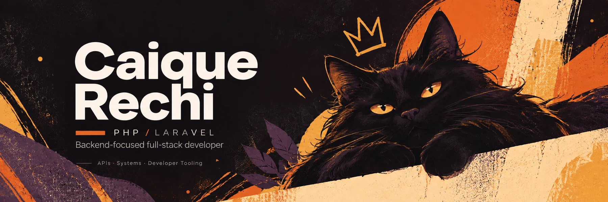

  

# Hi, I'm Caique Rechi 👋

**Backend-Focused Full-Stack Developer | PHP & Laravel**

I’m a Brazilian developer with 5+ years of experience building and evolving production web applications, REST APIs, payment integrations and internal business systems.

I enjoy transforming complex business rules into secure, maintainable software and improving the engineering practices around the systems I work on.

### Main stack

  

  <strong>PHP</strong> · <strong>Laravel</strong> · MySQL · React · TypeScript · JavaScript · Tailwind CSS · Docker · Git · GitHub Actions

### Selected work

- **[Rechi](https://github.com/CaiqueRechi/Portifolio)** — Laravel 13 + React/Inertia application with access control, external integrations, encrypted credentials, Redis, automated tests, static analysis and CI/CD.
- **[Payment Flow Service](https://github.com/CaiqueRechi/payment-flow-service)** — Laravel API focused on payment lifecycle management, auditable status history and automated tests.
- **[Claude Crow](https://github.com/CaiqueRechi/claude-crow)** — Versioned Claude Code plugin with engineering skills, validation, automated releases and checksums.
- **[BudgetCore](https://github.com/CaiqueRechi/budgetcore-app)** — Laravel financial management system covering customers, suppliers, transactions and accounts payable.

### Developer tooling

  
  &nbsp;&nbsp;&nbsp;
  

**[Claude Crow](https://github.com/CaiqueRechi/claude-crow)** — My Claude Code plugin for project context, engineering conventions, requirements analysis, implementation, local Docker workflows and defensive security validation.

**[CrowDex](https://github.com/CaiqueRechi/rm-skill-codex)** — The Codex adaptation of these skills, designed to preserve conventions and workflow continuity across both coding tools.

### A little more about me

- Experienced with REST APIs, webhooks, integrations and payment flows
- Comfortable maintaining and modernizing legacy PHP applications
- Hands-on with automated testing, CI/CD, static analysis and observability
- NASA Space Apps Challenge medalist
- Based in Brazil and open to remote opportunities

[Portfolio](https://rechi.net.br/) · [LinkedIn](https://www.linkedin.com/in/caique-rechi/)

> Building useful software and leaving the codebase better than I found it.
